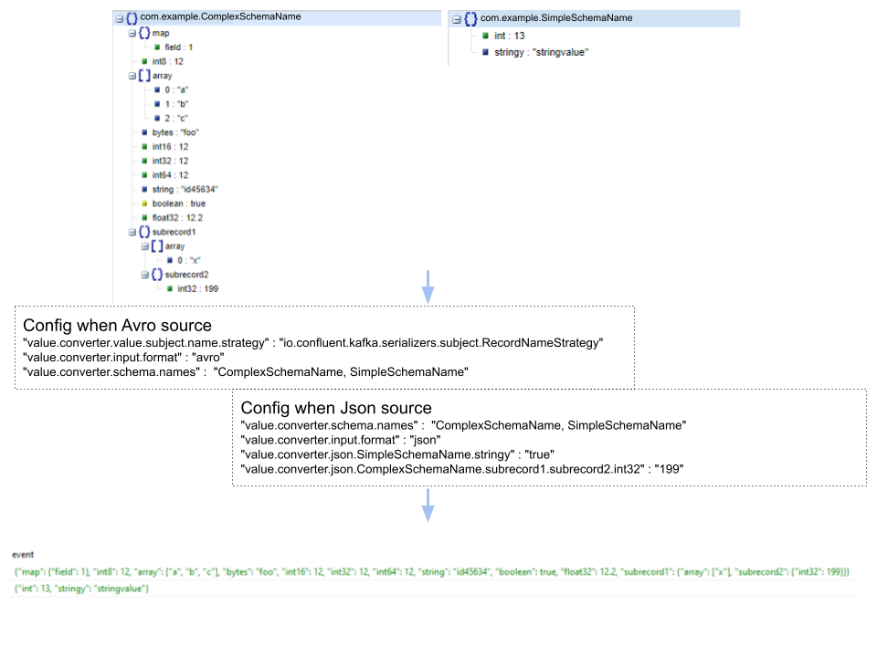
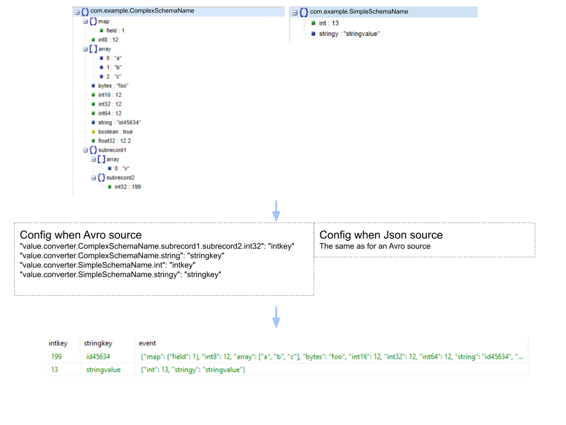
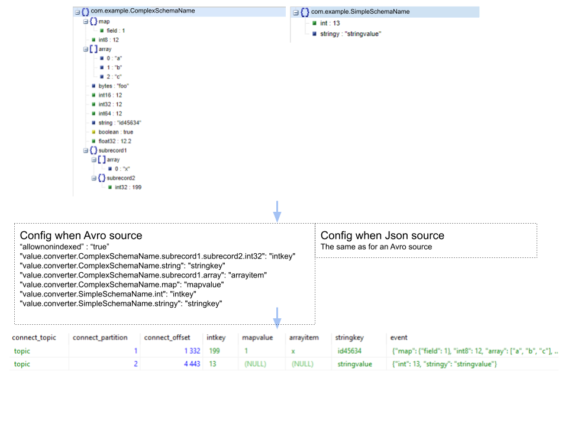
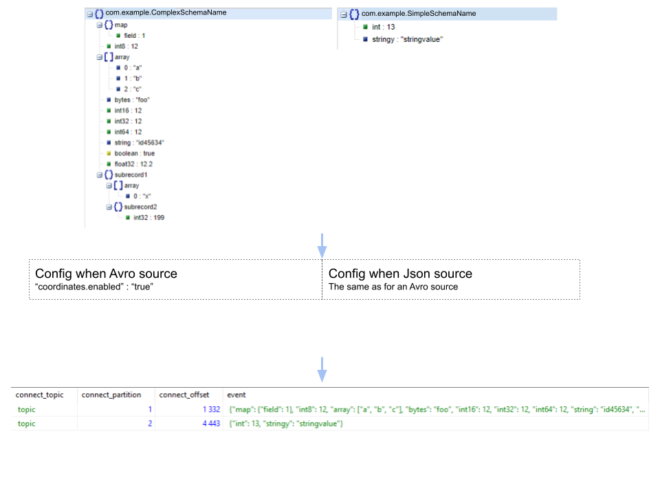

# Kafka Connect JDBC RDBMS JSON Event Store Sink Connector

  

The Kafka Connect JDBC RDBMS JSON Event Store Sink Connector allows you to export data from Kafka topics in JSON or Avro format
to the following RDBMSs (Netezza Performance Server, Oracle Exadata, Postgresql).

The connector polls data from Kafka to write to the database based on the topics subscription.
The connector supports the different subject naming strategies in case of Avro and is therefore capable of handling multiple Avro
schema structures. In case of a source topic where messages are serialized as JSON, the connector allows schema-less consumption.

The sink connector stores the messages as JSON datatype in the target system (JSONB in case of Netezza Performance Server and
Postgresql, BLOB in case of Oracle Exadata).
By configuration you define fields you want to have extracted to their own target columns.
Indexing on these columns is handled with Big Data indexing features e.g. zonemaps, partitioning, clustering, bloom filtering.
This should allow for higher insert performance than traditional B-tree indexing while at the same time
limiting table scans on point queries, range queries and set queries.

The combination of JSON serialized target values for the message values and indexed columns as meta-data for the messages makes
this sink connector a candidate for Event store patterns.

In principal, the common insert mode is Insert. However, it is possible to achieve idempotent writes with Upsert mode.
Deletes and Update insert modes are alo supported.
Auto-creation of tables, and limited auto-evolution is also supported.

The connector extends the Confluent jdbc sink connector:
https://github.com/confluentinc/kafka-connect-jdbc

# Config parameters:
The following lists configuration options of the connector that are in addition (most) of the configuration parameters listed at
https://www.confluent.io/hub/confluentinc/kafka-connect-jdbc.

### value.converter
default `no.norsktipping.kafka.connect.converter.JsonConverter`

    The sink connector depends on the the following Kafka Connect converter as 
    the Kafka record value converter. This converter resides in a 
    seperate module, but is packaged together with this connector:
    no.norsktipping.kafka.connect.converter.JsonConverter
    Assure you configure this converter.

### value.converter.input.format
default `empty`

    Whether the messages from the source topic are serialized JSON or AVRO.
    Set this configuration either to json or to avro.

### value.converter.schema.names
default `empty`

    

    In case of input.format avro:
        - Specify the Avro schema names suffixes of the messages that will be consumed from the source topic.
        - In case there are multiple schemas set value.converter.value.subject.name.strategy to 
          io.confluent.kafka.serializers.subject.RecordNameStrategy.
    In case of input.format json:
        - Specify a schema name for each expected JSON structure that is to be encountered on the source topic.
        - Specify a boolean rule or equality rule that helps the connector to recognize to which schema name each message belongs e.g. 
          "value.converter.json.<schema name 1>.<fieldname 2>": "true"
          This rule will identify each message that has a fieldname 2 to belong to schema name 1.
          Nested fields can be specified dot-delimited e.g. fieldname 4 within fieldname 3 within fieldname 2:
          "value.converter.json.<schema name 1>.<fieldname 2>.<fieldname 3>.<fieldname 4>": "true"

### extracting schema fields
default `empty`

    

    Dereference fields to their own target columns.
    With field paths configured, the connector extracts these and writes their values
    to their own target columns. This to allow indexing on these columns.

    Specify the field path for each of the field to extract e.g.:
    "value.converter.<schema name>.<fieldname 2>.<fieldname 3> : <target column name>

    Unless you use parameter allownonindexed = false, for each schema there need to 
    be a target column name (this assures the indexing possibility for all source structures).

### value.converter.payload.field.name
default `event`

    By default the message payload will be mapped to a target column named event.
    This parameter allows to override the target column name of the JSONB column used
    to store the message payload.

### value.converter.allownonindexed
default `false`

    

    Whether to allow for target column field dereferencing for fields fir some schemas but not for all.
    By default this is disabled so that for each schema there need to be a target column name.
    The idea is to extract mostly mandatory fields to achieve better indexing.

### coordinates.enabled
default `false`

    

    Whether to store topic, partition, offset, timestamp and timestamp in the target table.
    connect_topic, connect_partition, connect_offset will be used as column names when this
    parameter is set to true.

### delete.keys
default `empty`

    One or several field values from the Kafka record key that will be used when delete.enabled is
    set to true to delete rows that match the values of these fields. In case the key is a 
    primitive it will always be a single value, in case the key is an avro struct, several
    fields can be selected. Assure the same field with the same datatype exists on the converted
    Kafka record value for all configured schemas. The configured keys are used in the WHERE restriction on delete. Depending
    on the cardinality of the key(s) chosen this allows for serie deletion.
    Delete is triggered by tombstone records i.e. non-null key value and null value.
    Connect exception is thrown when source records are detected that are missing one of the configured
    fields.

### upsert.keys
default `empty`

    In any case one wants to configure with insert.mode UPSERT or UPDATE, one or several field 
    values from the converted Kafka record value to update or upsert rows that match the values
    of these fields. Assure the same field with the same datatype exists on the converted
    Kafka record value for all configured schemas. The configured keys are used in the WHERE 
    restriction on update and upsert (which is executed as a sequenced delete followed by insert). 
    Assure the combination of the key(s) chosen allows for a one-to-one cardinality i.e. that an
    individual update or upsert affects at most one individual target row.
    Connect exception is thrown when source records are detected that are missing one of the configured
    fields.

### casting
    The converter will independent of avro or json source, create Kafka Connect Struct with optional
    fields. All with datatype string. This is done to allow multi-schema, multi-datatype input.
    Single Message Transformation can be used to cast target column values to required data type.
    E.g. a column intkey that is configured under extracting schema fields can be cast to int64 with
    help of for example the following SMT (https://docs.confluent.io/platform/current/connect/transforms/overview.html):
    "transforms": "CastV"
    "transforms.CastV.type": "org.apache.kafka.connect.transforms.Cast$Value"
    "transforms.CastV.spec": "intkey:int64"
    Multiple fields can be specified in a single cast spec.

### distributionattributes
default `empty`

    When the target table is not pre-created and auto.create is enabled, a partitioned table will be 
    created on respective RDBMS Exadata, Netezza Performance Server or Postgresql.
    The distribution of rows happens based on the selected field(s).
    This to provide improved query performance for range queries or point queries but at the same 
    time efficient insert performance by not using traditional B-tree indexing.
    This translates to a DISTRIBUTE ON clause on Netezza and PARTITION BY HASH in case of Exadata 
    and Postgresql.
    As opposed to Postgresql are Exadata and Netezza Performance Server MPPs where the partitions will be physically distributed.

### clusteredattributes
default `empty`

    When the target table is not pre-created and auto.create is enabled, a clustered table will be 
    created on respective RDBMS Exadata, Netezza Performance Server (Postgresql doesn't support this concept).
    
    Rows with values that match the ones configured in clusteredattributes will be physically colocated on disk.
    This to provide improved query performance for range queries or point queries but at the same 
    time efficient insert performance by not using traditional B-tree indexing.
    This translates to a ORGANIZE ON clause on Netezza and CLUSTERING BY INTERLEAVED ORDER in case of Exadata.
    
    In case of Postgresql a bloom filter is utilized to compensate. This results in embedded anti-indexer
    which support the same concept of low maintenance of index on insert while helping out on fullfulling
    range and point queries on respective columns. In the specific case of bloom filter by knowing where not to 
    look to find queries row(s).

### zonemapattributes
default `empty`

    When the target table is not pre-created and auto.create is enabled, the respective RDBMS creates zonemaps 
    on the configured columns. Thos translates to MATERIALIZED ZONEMAP for Exadata, ZONEMAP on Netezza Performance
    Server (which are auto-created) and BRIN on Postgresql. 
    These result in embedded anti-indexer which support the concept of low maintenance of index on insert while helping 
    out on fullfulling range and point queries on respective columns.

### partitions
default `10`

    The amount of partitions to use when distributionattributes is set. 

# License

This project is licensed under the [Confluent Community License](LICENSE).